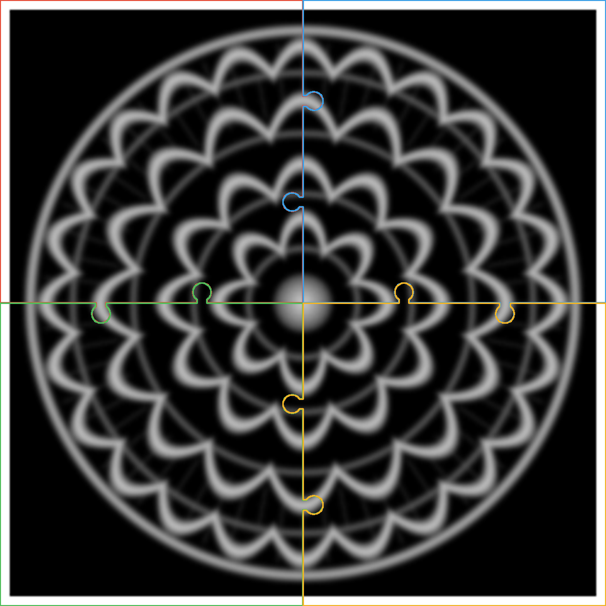

# Cuadros 3D Puzzle

Convierte cualquier imagen en un **cuadro 3D en relieve** dividido en **4 piezas que encajan como un rompecabezas**, para imprimir cuadros grandes en una impresora normal.

**Landing:** https://fleremiasflemin20-maker.github.io/cuadros-3d-puzzle/

**Generador en el navegador (sin instalar nada):** https://fleremiasflemin20-maker.github.io/cuadros-3d-puzzle/generador/

Sube tu imagen, ajusta el tamaño y la profundidad, mira la vista previa y descarga un ZIP con las 4 piezas. Todo se procesa en tu navegador, así que la imagen no se sube a ningún servidor.



## Qué hace

- Lee tu imagen (JPG/PNG) y convierte cada tono de gris en una altura: lo oscuro sobresale y lo claro queda en la base.
- Divide el cuadro en 2×2 piezas con **dos pestañas de rompecabezas por unión** y una holgura de 0,25 mm.
- Exporta **4 STL cerrados** (sin errores de malla) más una `vista_previa.png` con los cortes.
- Comprueba que cada pieza quepa en la cama de tu impresora antes de generar nada.

Valores por defecto pensados para la **Creality K2 Plus** (cama de 350×350 mm): cuadro de 62 cm de ancho y piezas de unos 33 cm.

## Versión de línea de comandos (Python)

### Instalación

```bash
git clone https://github.com/fleremiasflemin20-maker/cuadros-3d-puzzle
cd cuadros-3d-puzzle
python3 -m venv .venv
.venv/bin/pip install -r requirements.txt
```

### Uso

```bash
.venv/bin/python cuadro_puzzle.py mi_foto.jpg
```

Genera `salida_mi_foto/` con:

| Archivo | Pieza |
|---|---|
| `pieza_A_sup_izq.stl` | arriba a la izquierda |
| `pieza_B_sup_der.stl` | arriba a la derecha |
| `pieza_C_inf_izq.stl` | abajo a la izquierda |
| `pieza_D_inf_der.stl` | abajo a la derecha |
| `vista_previa.png` | mapa de alturas con los cortes |

### Opciones

| Opción | Por defecto | Qué hace |
|---|---|---|
| `--ancho` | 620 | ancho total del cuadro en mm (el alto sigue la proporción de la imagen) |
| `--base` | 3 | grosor de la base en mm |
| `--relieve` | 4 | altura máxima del relieve en mm |
| `--invertir` | — | hace que lo claro sobresalga en vez de lo oscuro |
| `--marco` | 10 | ancho del marco elevado en mm (0 = sin marco) |
| `--holgura` | 0.25 | separación entre piezas en mm |
| `--res` | 0.5 | resolución de la malla en mm |
| `--suavizado` | 1 | desenfoque previo de la imagen |
| `--cama` | 350 | tamaño de la cama de tu impresora en mm |
| `--salida` | `salida_<nombre>` | carpeta de salida |

Ejemplo para una cama de 256 mm (Bambu Lab P1S/X1/A1):

```bash
.venv/bin/python cuadro_puzzle.py mi_foto.jpg --cama 256 --ancho 470
```

## Consejos de impresión

- Imprime las piezas **con la cara plana sobre la cama**.
- Imprime primero una sola pieza y prueba el encaje con su vecina. Si entra muy apretada, sube `--holgura` a 0.35.
- Capa de 0,12 a 0,16 mm para que el relieve salga fino.
- Une las piezas con pegamento instantáneo (CA) por detrás.
- Las imágenes con buen contraste (siluetas, logos, dibujos de líneas, mandalas) dan los mejores relieves.

## Estructura

```
cuadro_puzzle.py          generador principal
herramientas/piezas_web.py  exporta las piezas livianas que usa la landing
ejemplos/mandala.png      imagen de ejemplo
index.html                landing (GitHub Pages)
generador/                generador web: interfaz (app.js) y motor en Web Worker (motor.js)
assets/                   vista previa y piezas 3D para la web
```

## Licencia

MIT
